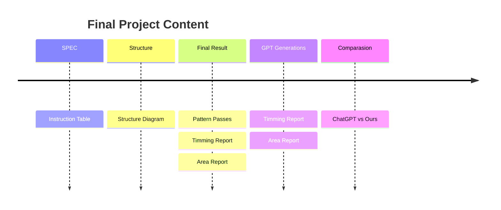
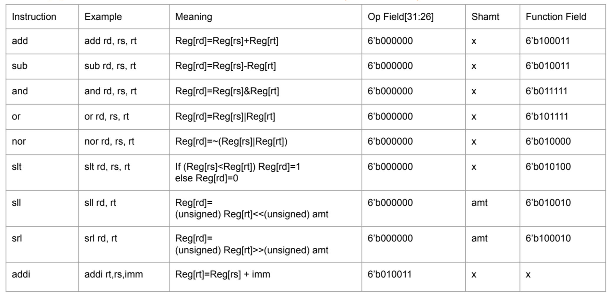
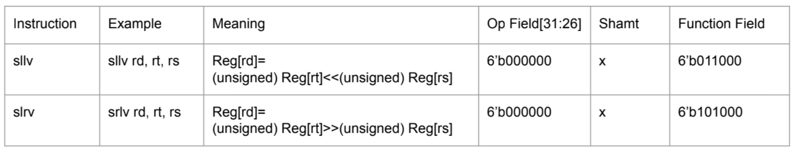
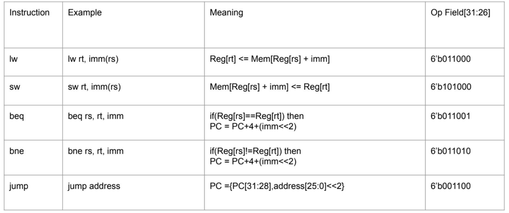
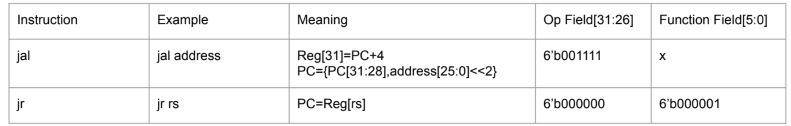
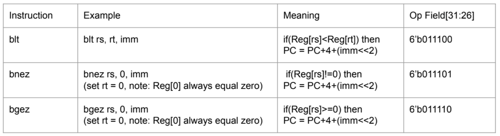
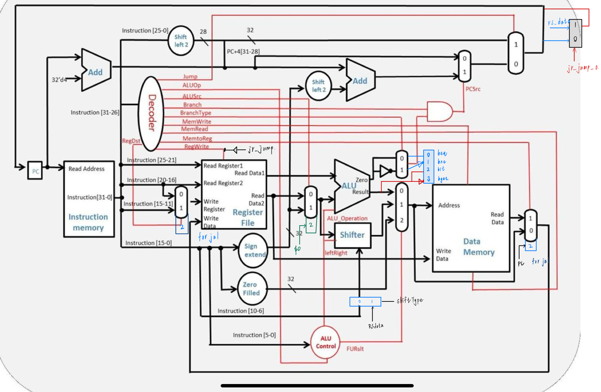
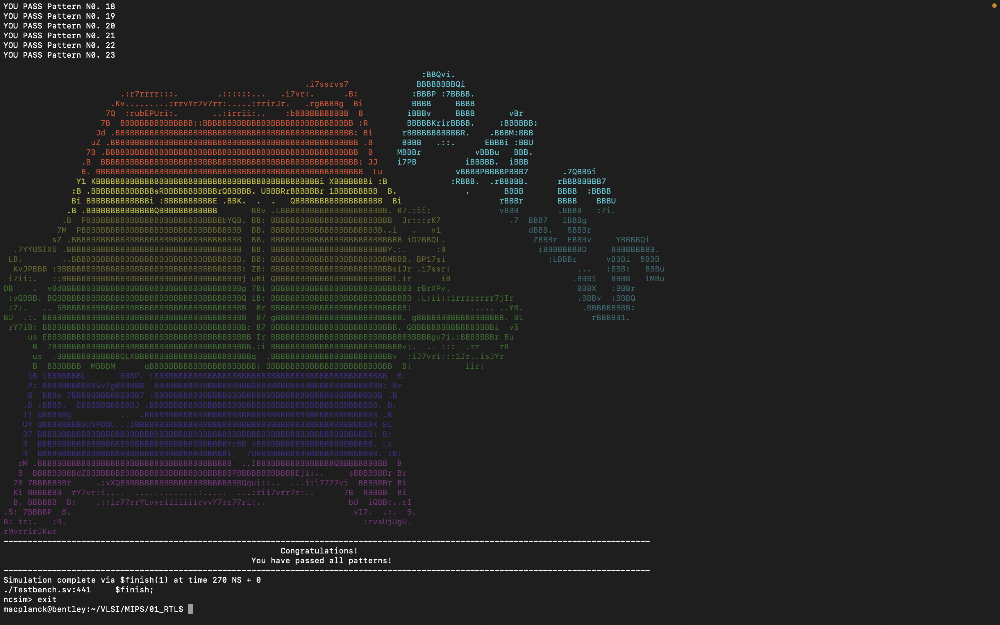
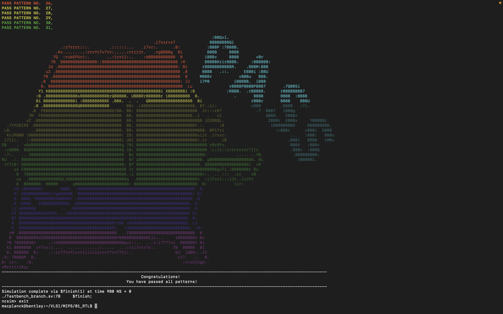

# VLSI Final Project

</br>

## Content



### **SPEC**

Following the MIPS Instructions listed below: 
- `R-Type` Instructions



- `I-Type` Instructions


- `Jump` Instructions


- Other Advanced Instructions



### **Overall Structure**




### **Final Result**

- `Pattern Test`
    - [`run.log`](REPORT/MIPS/01_RTL/run.log)
    
    - [`jump.log`](REPORT/MIPS/01_RTL/jump.log)
    
    - [`branch.log`](REPORT/MIPS/01_RTL/branch.log)
    


- [`Area Report`](REPORT/MIPS/02_SYN/MIPS.area)

```shell!
    Total cell area:                 16775.488702
    Total area:                      16775.488702
```

- [`Timing Report`](REPORT/MIPS/02_SYN/MIPS.timing)

```shell!

    ##########################################################################
    ###   Critical Path                                                    ###
    ##########################################################################
    
    Startpoint: RF/Reg_File_reg[18][30] 
                (rising edge-triggered flip-flop clocked by clk_i)
    Endpoint: PC/pc_out_o_reg[18]
                (rising edge-triggered flip-flop clocked by clk_i)
    Path Group: clk_i
    Path Type: max

    ##########################################################################
    ###   Slack                                                            ###
    ##########################################################################
    
    --------------------------------------------------------------------------
    data required time                                                 0.59
    data arrival time                                                 -0.59
    --------------------------------------------------------------------------
    slack (MET)                                                        0.00
    
```

### **ChatGPT Generations**
- [`CODE`](GPT_MIPS)


- [`Area Report`](REPORT/GPT_MIPS/02_SYN/GPT_MIPS.area)

```shell!
    Total cell area:                 13874.716765
    Total area:                      13874.716765
```

- [`Timing Report`](REPORT/GPT_MIPS/02_SYN/GPT_MIPS.timing)

```shell!

    ##########################################################################
    ###   Critical Path                                                    ###
    ##########################################################################
    
    Startpoint: m_Register/regs_reg[16][18]
                (falling edge-triggered flip-flop clocked by clk)
    Endpoint: m_PC/pc_o_reg[1]
                (rising edge-triggered flip-flop clocked by clk)
    Path Group: clk
    Path Type: max

    ##########################################################################
    ###   Slack                                                            ###
    ##########################################################################
    
    --------------------------------------------------------------------------
    data required time                                                 0.98
    data arrival time                                                 -0.98
    --------------------------------------------------------------------------
    slack (MET)                                                        0.00

```


### **Comparasion**

<table>
    <tr>
        <th>                                      </th>
        <th> Coding Level                         </th>
        <th> Min Cycle Time                       </th>
        <th> Area of Cycle 1ns                    </th>
        <th> Work                                 </th>
    </tr>
    <tr>
        <th> MIPS                                 </th>
        <td> Gate Level                           </td>
        <td> 0.6 ns                               </td>
        <td> 111156.972018                        </td>
        <td> More Instruction Supported           </td>
    </tr>
    <tr>
        <th> GPT_MIPS                             </th>
        <td> GATE Level                           </td>
        <td> 1.0 ns                               </td>
        <td> 13874.716765                         </td>
        <td> Don't Support Advance Instructions   </td>
    </tr>
</table>


</br>


## Note: Test Environment

- **`01_run`**: ```ncverilog```
- **`02_syn`**: ```UMC-40nm```


