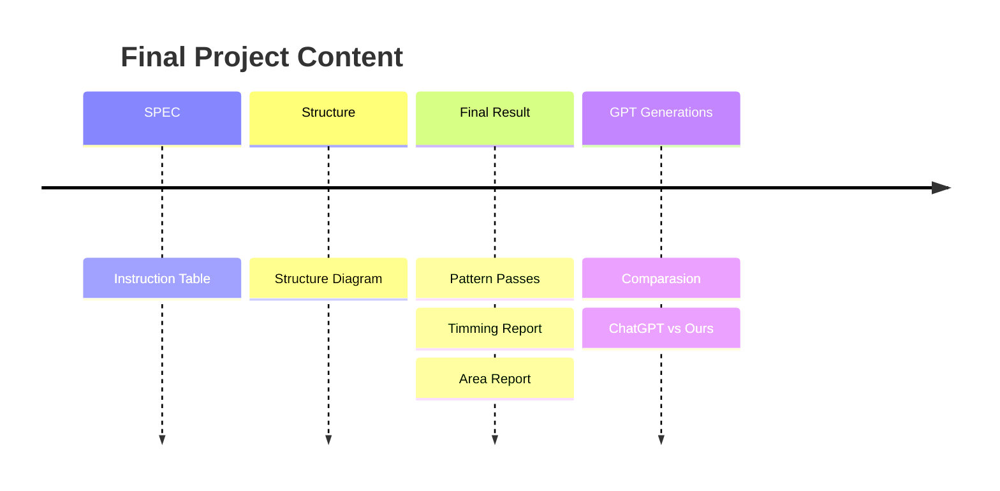

# VLSI Final Project V2

</br>

## Content



### **SPEC**

Following the MIPS Instructions listed below: 
- `R-Type` Instructions


- `I-Type` Instructions


- `Jump` Instructions


- Other Advanced Instructions


### **Overall Structure**


### **Final Result**

- `Pattern Test`
    - **run**
    
    - **jump**
    
    - **branch**
    


- `Area Report`

```shell!
    Total cell area:                 16775.488702
    Total area:                      16775.488702
```

- `Timing Report`

```shell!

    ##########################################################################
    ###   Critical Path                                                    ###
    ##########################################################################
    
    Startpoint: RF/Reg_File_reg[18][30] 
                (rising edge-triggered flip-flop clocked by clk_i)
    Endpoint: PC/pc_out_o_reg[18]
                (rising edge-triggered flip-flop clocked by clk_i)
    Path Group: clk_i
    Path Type: max

    ##########################################################################
    ###   Slack                                                            ###
    ##########################################################################
    
    --------------------------------------------------------------------------
    data required time                                                 0.59
    data arrival time                                                 -0.59
    --------------------------------------------------------------------------
    slack (MET)                                                        0.00
    
```

### **ChatGPT Generations**
- [`CODE`](GPT_MIPS)


### **Comparasion**

<table>
    <tr>
        <th>                    </th>
        <th> Coding Level       </th>
        <th> Cycle Time         </th>
        <th> Area               </th>
        <th> Work               </th>
    </tr>
    <tr>
        <th> MIPS               </th>
        <td> Gate Level         </td>
        <td> 0.6 ns             </td>
        <td> 16775.488702       </td>
        <td> TRUE               </td>
    </tr>
    <tr>
        <th> GPT_MIPS           </th>
        <td> Behavorial Level   </td>
        <td> X                  </td>
        <td> X                  </td>
        <td> FALSE              </td>
    </tr>
</table>


</br>


## Note: Test Environment

- **`01_run`**: ```ncverilog```
- **`02_syn`**: ```40nm``` 製程


